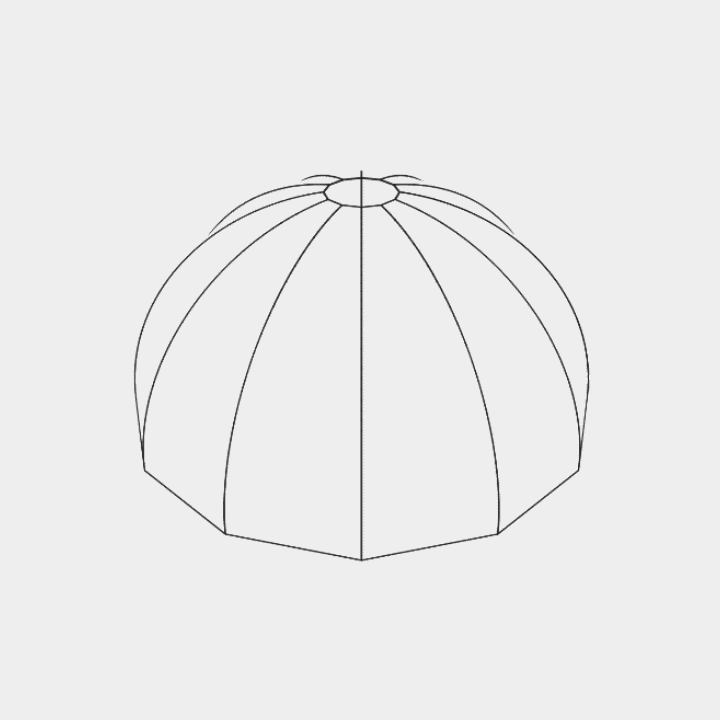

# ParaGen

**Procedural parachute patterns for engineering and design**

<p align="center">
  
</p>

<br/>
<br/>
<p align="center"><a href="https://para-gen-kohl.vercel.app/">🔗 https://para-gen-kohl.vercel.app/</a></p>

<br/>
<br/>

[ParaGen](https://para-gen-kohl.vercel.app/) is a tool that generates mathematically perfect 3D parachute canopies and flattens them into 2D laser-cuttable DXF patterns.

The models can be customized and downloaded, and are meant to be then cut out of fabric of choice and assembled.

ParaGen is a **passion project**, not a commercial product of any kind! 

### The name ParaGen

The name ParaGen comes from the combination of "Parachute" and "Generator", reflecting the app's purpose: allowing engineers and hobbyists to seamlessly design and auto-generate custom aerodynamic blueprints without relying on heavy CAD software.

### Technology

The tool runs locally as a webapp, built with vanillajs and React, using [ThreeJS](https://threejs.org) and [vitejs](https://vite.dev). The models are generated completely procedurally through real-time arc geometry and have a custom rendering pipeline targeting a highly technical, blueprint-style monochrome aesthetic.

## Using ParaGen

### Build the canopies

Anyone with fabric and a sewing machine can construct the physical parachutes.

1. Open the ParaGen application,
1. Tweak the 3D dimensions (Diameter, Shape Ratio, Panel Count) to your liking,
1. Hit download and open the generated DXF technical pattern in your favorite laser cutting or printing software,
1. Cut the identical panels out and sew them down the calculated offset line!

### Build the app

The app uses [vitejs](https://vite.dev).

```
npm install # install dependencies
npm run dev # for local development
npm run build # for production build
```

## Roadmap

The roadmap is not set in stone and is mostly a list of ideas to extend ParaGen.

* Expand DXF metadata logging.
* Advanced mode for customizable bridle lengths and rigging.